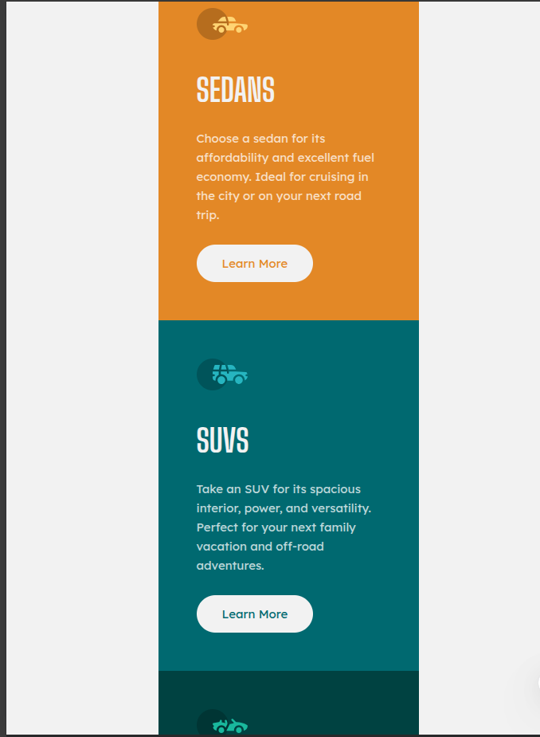

# 3-Column Preview Card Component

This project features a **responsive 3-column layout** showcasing three different car categories: **Sedans**, **SUVs**, and **Luxury**. Each card includes an icon, a title, a brief description, and a call-to-action button.

---
## Preview

---

## 🚀 Features

- Modern, clean design       
- Fully responsive layout 
- Visually distinctive cards
- Interactive hover effects
- Easy to customize

---

## 📁 Files Included

- [`https://github.com/ub-victor/A-simple-repostive-html-css/blob/main/index.html`](#) — The main HTML structure
- [`https://github.com/ub-victor/A-simple-repostive-html-css/blob/main/style.css`](#) — Styles to make the layout visually appealing

---

## 🔧 Usage

- Vs code

### Viewing Locally

1. Download or clone the repository.
2. Ensure both `index.html` and `style.css` are in the same directory.
3. Open `index.html` in your preferred web browser.

### Customization Tips

- Swap out icon images (`img/icon-sedans.svg`, etc.) within the HTML.
- Modify the text inside each card to fit your needs.
- Adjust styles in `style.css` to change colors, fonts, or layout.

---

## 💻 Technologies Used

- HTML5
- CSS3
- Google Fonts

---

## 📝 License

This project is open-source and can be freely customized and distributed.

---

## 🎨 Notes

- Make sure to include your icon images in an `img` folder, or update the `src` paths accordingly.
- Designed to be mobile-friendly with adaptive layout adjustments.